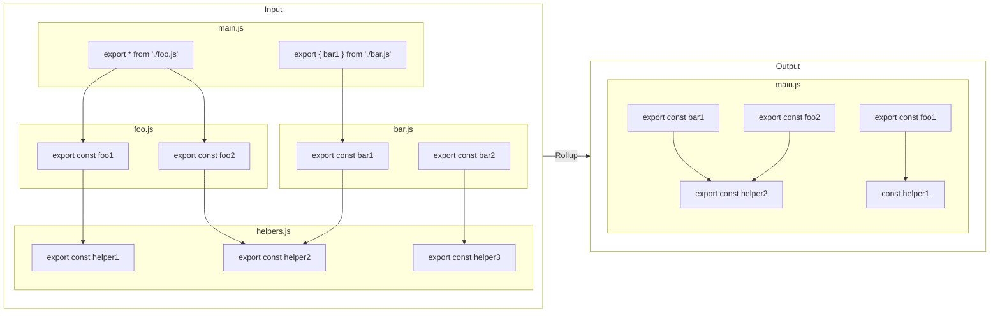
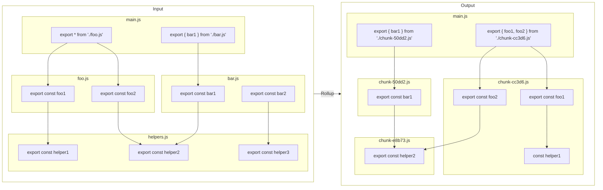

# rollup-plugin-chunk-per-export

This plugin analyzes your Rollup bundle, and ensures each export ends up in a separate file (a "chunk", in Rollup parlance). Any dependencies called from each of those exports, are still bundled normally and shared between chunks if needed.

## Why

**Tree-shaking.** If you're making a library that's going to end up in somebody's browser, you want to make sure that bundlers can tree-shake your library, and takes only the parts of your library that are being used.

However, bundlers do often play it safe and only tree-shake along file boundaries. That is, if you use `smallFunction`, but it's in the same file as `bigFunction`, both of them will end up in the final bundle, just in case you do call that function somehow. _In my experience this is true even if you set `"sideEffects": false` in your `package.json`._

It is unfortunate then, that Rollup (as bundlers do), likes to put all of your code in the same file, if you're creating a library. That's where this plugin comes in.

## Comparison

<details>

<summary>Show comparison</summary>

**Before**



**After**



</details>

Without this plugin, Rollup bundles everything into the same file. With the plugin, each export from `main.js` is forced to be on their own file.
It does look more complex when the plugin is added, but remember that bundlers usually only tree-shake along file boundaries (yellow background); so it is more able to pick-and-choose specific exports.

## Limitations

- Your authored code should already be split into multiple files. This plugin does not move exports into their own file.

- Therefore, exports defined in the same file in your authored code, will also end up in the same file in the build output.

- It follows re-exports, but nothing else, to avoid skipping side-effects. Especially, the following re-export is not followed:

  ```js
  import { foo } from "./foo.js";
  export { foo as fooOriginal }; // Not followed :(
  export const fooWrapped = wrap(foo);
  ```

  You should modify it into a regular re-export:

  ```js
  import { foo } from "./foo.js";
  export { foo as fooOriginal } from "./foo.js"; // Followed! :)
  export const fooWrapped = wrap(foo);
  ```

  Any code that can't be expressed like that, is dependant on side-effects and therefore can't be safely tree-shaken.

## Usage

Install it to your `devDependencies`:

```sh
# if you use npm
$ npm install --save-dev rollup-plugin-chunk-per-export

# if you use yarn
$ yarn add --dev rollup-plugin-chunk-per-export
```

And add it to your `rollup.config.mjs`

```diff
 import { defineConfig } from "rollup";
+import chunkPerExport from "rollup-plugin-chunk-per-export";

 export default defineConfig({
   // ... your config here
   plugins: [
     // ...other plugins...
+    chunkPerExport(),
   ],
 });
```
